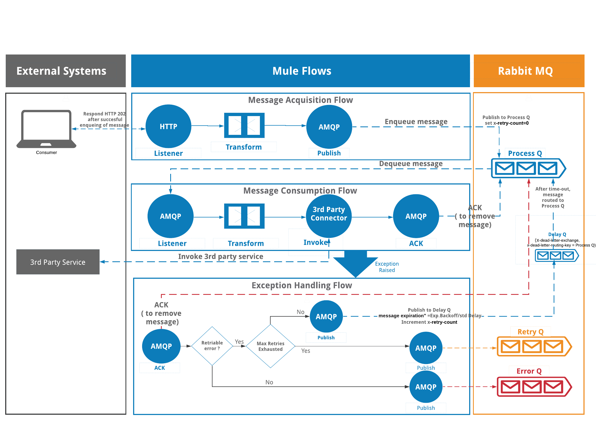
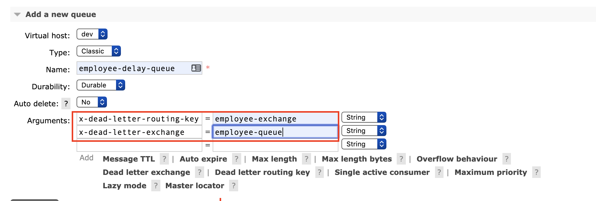

# Reliable Messaing Using Rabbit MQ

This is an example API to showcase how reliable messaging can be achieved using RabbitMQ as a messaging platform

### Why?
By separating different components with message queues, you create more fault tolerance. If one part of the system is ever unreachable, the other can still continue to interact with the queue.

This approach also ensures that the mule application will be decoupled into smaller, independent building blocks that are easier to develop, deploy and maintain and increases scalability.

### How?

The following diagram should articulate how this can be implemented:

This ensure that every application that uses this policy has isolated circuit state values.

### Usage
To test this example, you will require access to RabbitMQ. If not you can install it locally:

For RabbitMQ installation instructions please follow the link below :-
https://www.rabbitmq.com/download.html

After successful installation you should be able to run it Using

export PATH=$PATH:/usr/local/opt/rabbitmq/sbin
sudo rabbitmq-server

To access Rabbit MQ use the following url :-
http://localhost:15672/

Create Queues and Exchanges as per your configuration file.

When creating delay queue, ensure you configure "dead letter exchange" and "dead letter routing key" as shown below :-

License
----
UNLICENSED
